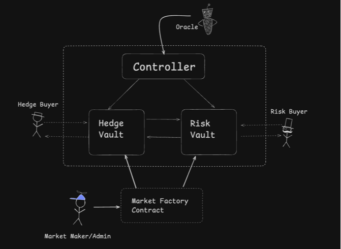
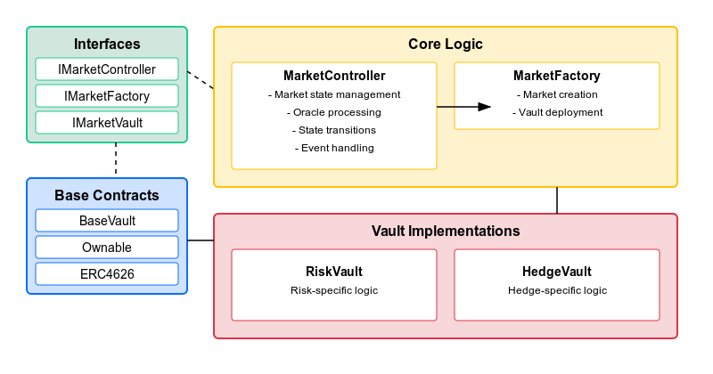
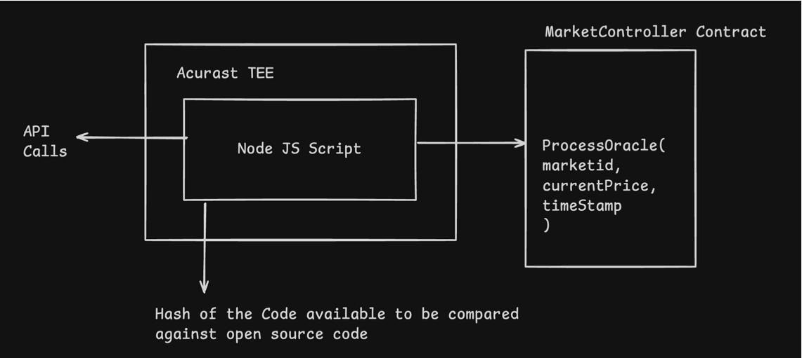
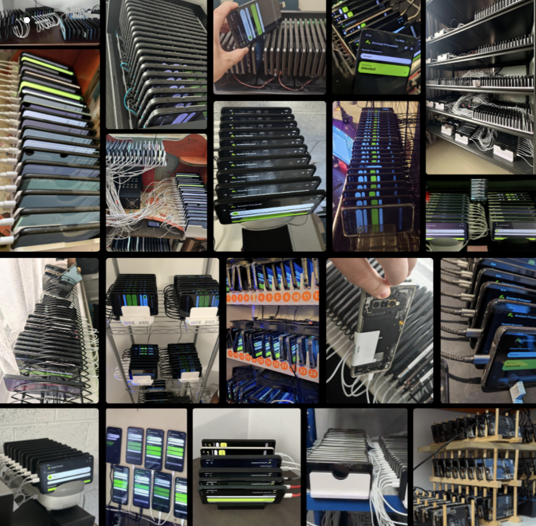
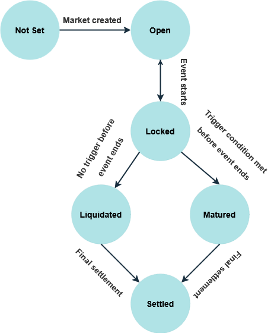

# HedgeWave

## What Did we Build and Why?

We set out to create a protocol to Hedge Real Life Risks.

We built a generalized Hedge/Risk Protocol that could be adapted for Insirance, Prediction Markets, or simply a way to Hedge against real life events

### Our Example: 
Hedge against Inflation of Turkish Lira.

## How did we do it? - Risk/Hedge Protocol

We built a protocol on top of ERC4626 primitive ((https://github.com/OpenZeppelin/openzeppelin-contracts/blob/master/contracts/token/ERC20/extensions/ERC4626.sol))


We then Combined Vaults to create our hedge/Risk



The Contract Architecture looks like this: 



## Oracle

We used Acurast TEEs to get real life data (not just on-chain price).



Funfact: 

All the Acurast TEEs are actually processors of old phones. They are a Depin project




## How to run this locally: 
Contract commands:

```
forge install
forge build
forge test
```

Script commands (check if environment variables are set by example):

```
forge clean
forge build
forge script script/CreateMarket.s.sol --rpc-url sepolia
forge script script/Deploy.s.sol --rpc-url sepolia
forge script script/DeployCore.s.sol --rpc-url sepolia
forge script script/DeployMainnet.s.sol --rpc-url sepolia
forge script script/DeployTestnet.s.sol --rpc-url sepolia
forge script script/ManageMarket.s.sol --rpc-url sepolia
```

To broadcast these transactions on-chain instead of simulate, add `--broadcast` flag at the end

Foundry environment variables: [.env.example](./.env.example)

UI commands:

```
cd ui
npm install
npm run dev
```

For production:

```
cd ui
npm run build
```

Open [http://localhost:3000](http://localhost:3000)

UI environment variables: [.env.example](./ui/.env.example)

Contracts deploy order:

- Deploy MarketController with empty constructor
- Deploy MarketFactory with controller and ERC20 asset addresses
- Call setMarketFactory function for MarketController with market factory address

Create a new market with parameters (start time, end time, trigger price)

Deposit flow:

- Check if deposits are allowed
- Approve amount of underlying asset (ERC20) to the spender (vault)
- Deposit to vault setting your address as a receiver

Helpful tools:

https://www.unixtimestamp.com/

Market states:



## Smart Contracts 

### ETH Sepolia using RLUSD 

* https://hedge-wave-ripple.vercel.app/

* ASSET TOKEN - HUSD (Mock ERC20)
    * 0xe101FB315a64cDa9944E570a7bFfaFE60b994b1D
    * https://sepolia.etherscan.io/address/0xe101fb315a64cda9944e570a7bffafe60b994b1d#code

* Controller 
    * 0x87e8B0a19087f0637AA9b27af2747F1CF1814182
    * https://sepolia.etherscan.io/address/0x87e8b0a19087f0637aa9b27af2747f1cf1814182#code

* Factory 
    * 0x452365460094825Cb1ee66ef9324C2C384ffe648
    * https://sepolia.etherscan.io/address/0x452365460094825cb1ee66ef9324c2c384ffe648#code
    
#### Major Achievements
   * Added a new oracle (Acurast) to the ecosystem that has access to web 2 data 
   * Built a new Framework that allows creation of various DEFI protocols on top of it 
        * Insurance 
        * Prediction Markets 
        * Hedging Risks 
        * Hedging Depegs 
   * Created various possible usecases for RLUSD     

#### Future Plans 
    * Create a generalized version of the protocol to be able to handle various hedging markets.
    * Have better integration with Acurast to handle various Forex Markets 
    * Research the possibility of building Insurance products based on this architecture. 
   
### Hedera Testnet 

* https://hedge-me-hedera.vercel.app/

* ASSET TOKEN - HUSD (Mock ERC20)
    * 0x194543C05F72Dd85bECD13B00d3DdF3d77daEDD7
    * https://hashscan.io/testnet/contract/0.0.5640748?ps=1&pa=1&pr=1&pf=1

* Controller 
    * 0xeA6928bDCcd7F756726C43CA7AD32d2398AFCFe3
    * https://hashscan.io/testnet/contract/0.0.5640750?pa=1&ps=1&pf=1&pr=1

* Factory 
    * 0x40293e9Eec7ceB331617C86DA17f2801083Ed74F
    * https://hashscan.io/testnet/contract/0.0.5640752?ps=1&pa=1&pr=1&pf=1
    
#### Markets Deployed 

* Market id 1
    * uint256: startTime 1740834000
    * uint256: endTime 1741006800
    * address: riskVault 0xf24d7A71863706429f79AC1C9eB883bc657F8365
    * address: hedgeVault 0xF67F2110f7DE7AB482C39509C36cc980a8d8f17E
    * strike price 17

* Market id 2
    * uint256: startTime 1740834000
    * uint256: endTime 1741438800
    * address: riskVault 0x3d8c1684Dc9Ff8F61A3Aa0C20AAad8e731068612
    * address: hedgeVault 0x2317BaD11916612687BDc4596C709D1ae9266C58
    * strike price 15

#### Major Achievements
   * Added a new oracle (Acurast) to the ecosystem that has access to web 2 data 
   * Built a new Framework that allows creation of various DEFI protocols on top of it 
        * Insurance 
        * Prediction Markets 
        * Hedging Risks 

#### Future Plans 
    * HTS integration to work with USDC on Hedera and other native Hedera Tokens
    * Disrupt Insurance market by bringing various automated Insurances on Hedera (Flight Insurance, Weather derivatives etc.)
    * Open Source Project and write documentation on how to launch Insurance products.  

### U2U Network Testnet (Nebula)

* https://hedhedge-u2u.vercel.app/

* ASSET TOKEN 
    * 0xCF23E2a7b247a5eae685Da0B66651048Dbc00fE8
    * https://testnet.u2uscan.xyz/address/0xCF23E2a7b247a5eae685Da0B66651048Dbc00fE8

* Controller
    * 0xA6A0f612A764B23CdEffac61Fe677380Ac7f5f32
    * https://testnet.u2uscan.xyz/address/0xA6A0f612A764B23CdEffac61Fe677380Ac7f5f32

* Factory
    * 0x55ED163F184b162F708E9d79C303D65a573508AE
    * https://testnet.u2uscan.xyz/address/0x55ED163F184b162F708E9d79C303D65a573508AE

#### Deployed Markets

* market id 1
    * address: riskVault 0xcf09463De1e4B06719F48cA9E7Bd623919E4A1cC
    * address: hedgeVault 0xbe6bB2230F9Eb6C94861Aad91d661FAd14D26452
    * uint256: startTime 1740828600
    * uint256: endTime 1741433400
    * strike price 15

* market id 2
    * address: riskVault 0x52f41Fb065d6CFBd68c6BA2f06b2BFd0b711a27e
    * address: hedgeVault 0x4919da093614EC2F829715454cBC355B212CFB30
    * uint256: startTime 1740828600
    * uint256: endTime 1741001400
    * strike price 18