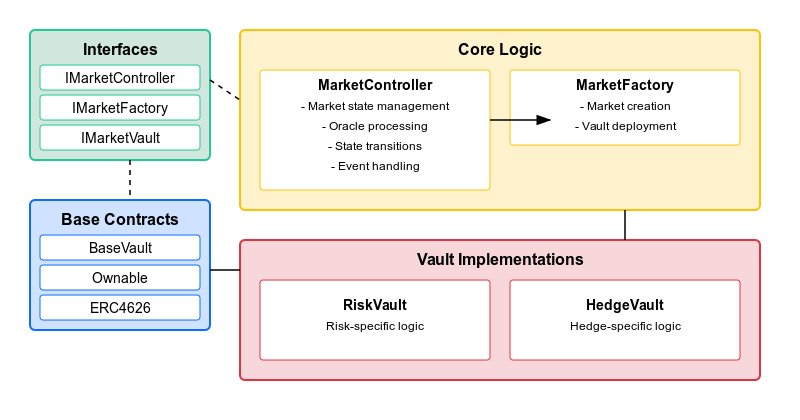

# Hedge Risk Standard



Based On ERC-4626 Vaults (https://github.com/OpenZeppelin/openzeppelin-contracts/blob/master/contracts/token/ERC20/extensions/ERC4626.sol)

Contract commands:

```
forge install
forge build
forge test
```

Script commands (check if environment variables are set by example):

```
forge clean
forge build
forge script script/CreateMarket.s.sol --rpc-url sepolia
forge script script/Deploy.s.sol --rpc-url sepolia
forge script script/DeployCore.s.sol --rpc-url sepolia
forge script script/DeployMainnet.s.sol --rpc-url sepolia
forge script script/DeployTestnet.s.sol --rpc-url sepolia
forge script script/ManageMarket.s.sol --rpc-url sepolia
```

To broadcast these transactions on-chain instead of simulate, add `--broadcast` flag at the end

Foundry environment variables: [.env.example](./.env.example)

UI commands:

```
cd ui
npm install
npm run dev
```

For production:

```
cd ui
npm run build
```

Open [http://localhost:3000](http://localhost:3000)

UI environment variables: [.env.example](./ui/.env.example)

Contracts deploy order:

- Deploy MarketController with empty constructor
- Deploy MarketFactory with controller and ERC20 asset addresses
- Call setMarketFactory function for MarketController with market factory address

Create a new market with parameters (start time, end time, trigger price)

Deposit flow:

- Check if deposits are allowed
- Approve amount of underlying asset (ERC20) to the spender (vault)
- Deposit to vault setting your address as a receiver

Helpful tools:

https://www.unixtimestamp.com/

Market states:


